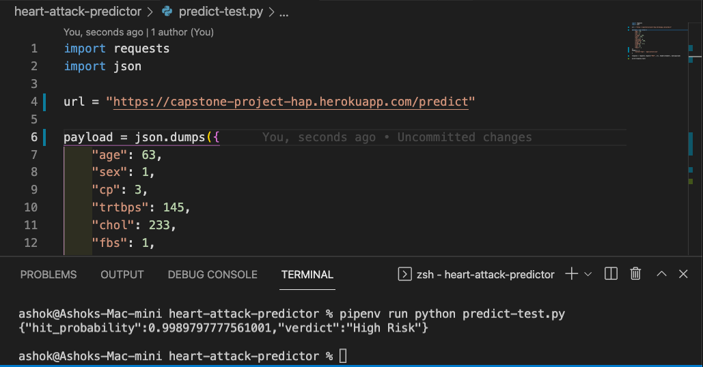

# DataTalks Zoomcamp Capstone Project: Heart Attack Predictor
## Problem description
The following dataset was used for this project: https://www.kaggle.com/ronitf/heart-disease-uci

This is a dataset consisting of patient data for predicting if they are likely to suffer from Heart Attack or not. It can be used to make a **classification model** that predicts whether a patient would be a 'Likely to get a Heart Attack' or not.

It consists of the following features: 
- age - Age of the patient
- sex - Sex of the patient
- cp - Chest pain type ~ 0 = Typical Angina, 1 = Atypical Angina, 2 = Non-anginal Pain, 3 = Asymptomatic
- trtbps - Resting blood pressure (in mm Hg)
- chol - Cholestoral in mg/dl fetched via BMI sensor
- fbs - (fasting blood sugar > 120 mg/dl) ~ 1 = True, 0 = False
- restecg - Resting electrocardiographic results ~ 0 = Normal, 1 = ST-T wave normality, 2 = Left ventricular hypertrophy
- thalachh - Maximum heart rate achieved
- oldpeak - Previous peak
- slp - Slope
- caa - Number of major vessels
- thall - Thalium Stress Test result ~ (0,3)
- exng - Exercise induced angina ~ 1 = Yes, 0 = No
- output - Target variable
## EDA
The following experiments were performed in the colab notebook for the analysis:
- Check for missing values
- Check for class imbalances by analysing the target variable
- Range of numerical attributes
- Histogram plot of each numerical attribute
- Check for Pearson and Spearman correlation to remove extra features. 
- Finding ANOVA values to see which numerical attributes are useful.

## Model training
Four models were trained on the dataset by splitting it into train/test/val of 60/20/20 %. They are:

- Logistic Regression,
- Decision Tree,
- Random Forest,
- and, XGB Boost

The accuracy before and after tuning for all the four models is as follows: 
| Model               | Accuracy on val (untuned)(in %) | Accuracy on val (tuned)(in %) |
|---------------------|---------------------------------|-------------------------------|
| Logistic Regression | 90.95                           | 91.06                         |
| Decision Tree       | 71.56                           | 80.71                         |
| Random Forest       | 88.23                           | 88.56                         |
| XG Boost            | 85.72                           | 89.37                         |

The best model was found to be Logistic Regression.
## Exporting notebook to script
The logic for training the best model is exported to a separate script named `train.py`.
## Model deployment
The model is deployed with Flask and is saved in a file named `predict.py`. The file `predict-test.py` can be used to test the Flask application.
## Dependency and enviroment management
The dependencies are managed using `pipenv` so you will need to have it installed on your system. It uses `Pipfile` and `Pipfile.lock` files for dependency management.

The dependencies can be installed by running `pipenv install` inside this directory and it will create a virtual environment inside the folder using those two files.

The file `requirements.txt` contains the list of dependencies in an easy to read format.

## Containerization
The file `Dockerfile` present in the directory can be used to create a Docker image which can then be used to run a container.

First, build the image using:

```docker build -t capstone-hap .```

and now run the image inside a container using:

```docker run -p 7000:7000 capstone-hap```

You can send request to the running container by making use of code in `predict-test.py` or use Postman to send a POST request.

## Cloud deployment

The Flask application is deployed to Heroku. It uses the `Procfile` present in the directory. It specifies the web server to use (gunicorn) and the filename (predict.py).

Steps followed to deploy to Heroku:

- ```git init```
- ```git add .```
- ```git commit -m "Adds files for capstone project"```
- ```heroku git:remote -a capstone-project-hap```
- ```git push heroku main```

`capstone-project-hap` is the name of the project that I created on the Heroku website.

Here's a screenshot testing the hosted application:


